<h1>Hello world!</h1>
<h3>The repository contains the documentary of me learning bits and bytes of data and ML with.<a href='#'>#300DAYSOFDATA</a>
</h3>
   <table>
        <tr>
            <th>Resources</th>
            <th>Status</th>   
            <th>Source</th>
        </tr>
        <tr>
            <td>Supervised Machine learning:Regression and Classification</td>
            <td>✅</td> 
            <td><a href='https://www.coursera.org/learn/machine-learning/home/week/1'>Course</a></td> 
        </tr>
        <tr>
            <td>Advance algorithms</td>
            <td>✅</td>  
            <td><a href='https://www.coursera.org/learn/advanced-learning-algorithms/home/week/1'>Course</a></td> 
        </tr>
        <tr>
            <td>Unsupervised learning, Recommenders , Reinforcement Learning</td>
            <td>✅</td>  
            <td><a href='https://www.coursera.org/learn/unsupervised-learning-recommenders-reinforcement-learning/home/week/1'>Course</a></td> 
        </tr>
        <tr>
            <td>Introduction to statistical Learning</td>
            <td>🏃‍♂️</td>
            <td><a href='statlearning.com'>Course</a></td> 
        </tr>
        <tr>
            <td>Patter Recognition and ML</td>
            <td>🏃‍♂️</td>
            <td><a href='https://www.microsoft.com/en-us/research/uploads/prod/2006/01/Bishop-Pattern-Recognition-and-Machine-Learning-2006.pdf'>Course</a></td> 
        </tr>
         <tr>
            <td>Probabitlity and Inference I</td>
            <td>🏃‍♂️</td>
            <td></td> 
        </tr>
    </table>

<h3>Day 1</h3>

 I learned about neural networks and logistic regression. In the logistic regression I learned to implement the gradient descent algorithm with Regularization. Learned to implement simple neural networks in Tensorflow.
Course link:
<a href='https://www.coursera.org/learn/advanced-learning-algorithms'>Machine Learning Specialization</a>
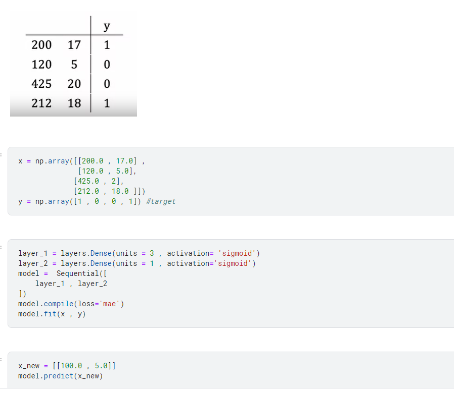

<h3>Day 2</h3>

 I learned about forward propagation from scratch using python. Learned about Linear Discriminant analysis and bayes classifier.
Course link:
<a href='https://www.coursera.org/learn/advanced-learning-algorithms'>Machine Learning Specialization</a>
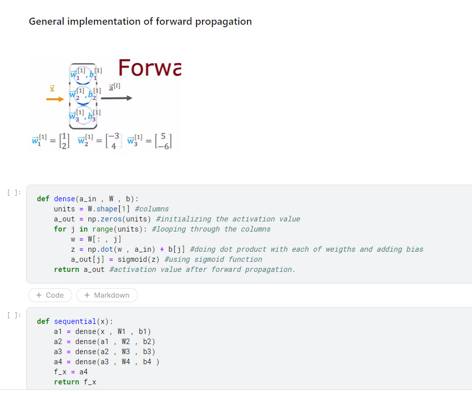

<h3>Day 3</h3>

 Its day 3 and I learned so many things today. I first learned about different classification models.Logistic regression , LDA, QDA , GLM and Naive Bayes. I implemented the code for the models with the help of ISLP book.
Course link:
<a href='statlearning.com'>ISLP</a>
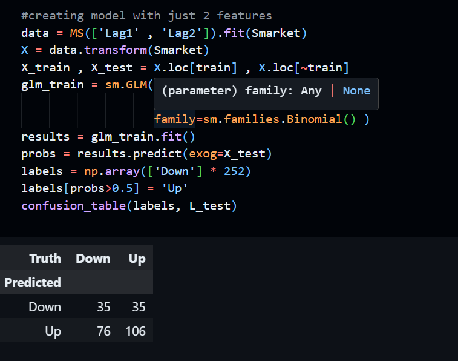
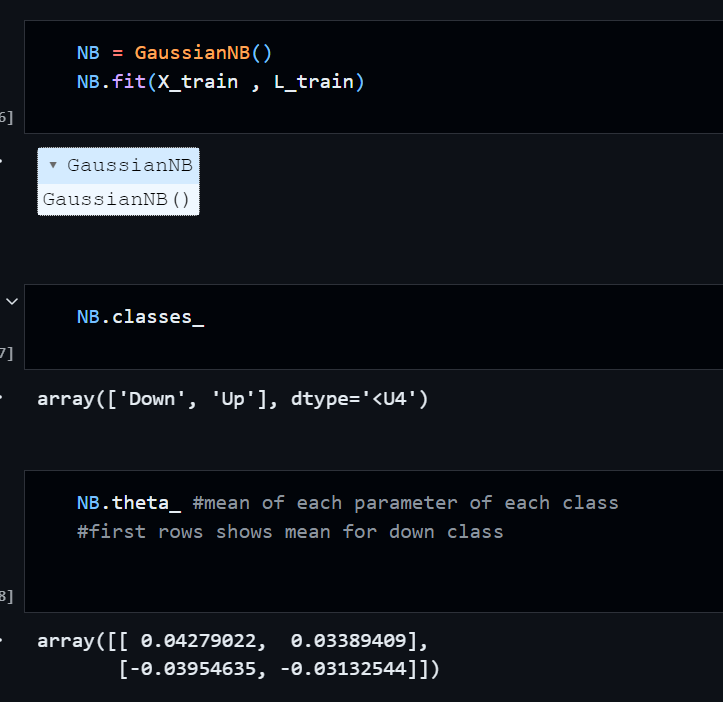

<h3>Day 4</h3>

 I implemented the code for the KNN Classifier with the help of ISLP book.
Course link:
<a href='statlearning.com'>ISLP</a>
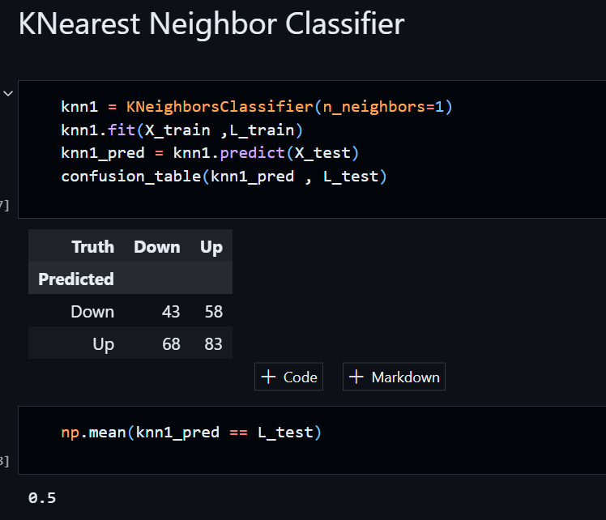

<h3>Day 5</h3>

 I learned about  Backpropagation. Started learning about cross validation method. 
Course link:
<a href='https://www.coursera.org/learn/advanced-learning-algorithms'>Machine Learning Specialization</a>
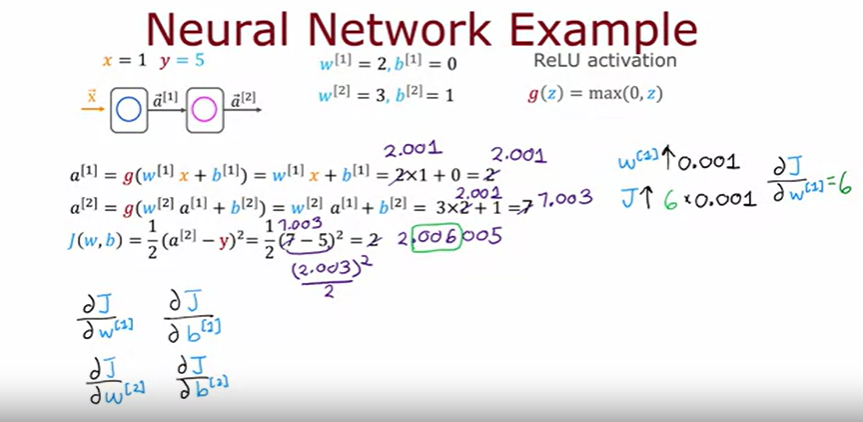

<h3>Day 6</h3>

 I learned about about cross validation method. 
Course link:
<a href='statlearning.com'>ISLP</a>
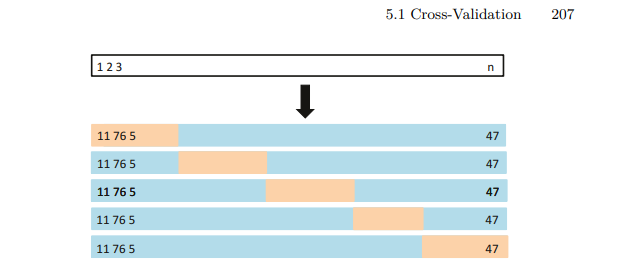

<h3>Day 7</h3>

 I learned about Bootstraping method in statistics. 
Course link:
<a href='statlearning.com'>ISLP</a>
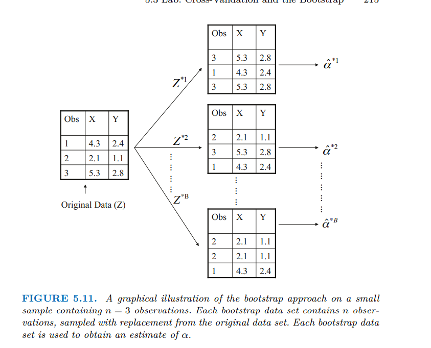

<h3>Day 8</h3>

 I learned to implement crossvalidation and Bootstrap with the help of ISLP book. I also learned about Bias-Variance Trade OFF from specialization
Course link:
<a href='statlearning.com'>ISLP</a> and 
<a href='https://www.coursera.org/learn/advanced-learning-algorithms'>Machine Learning Specialization</a>
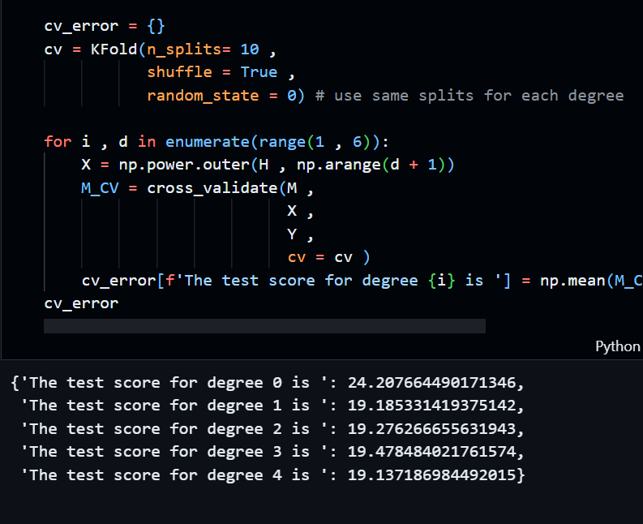
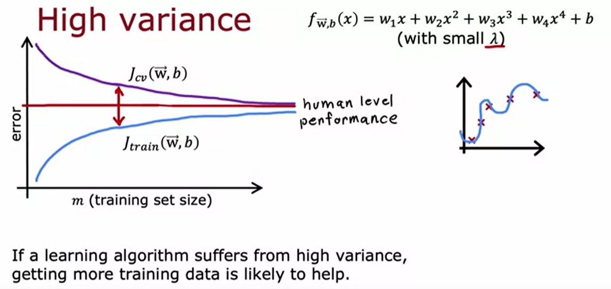

<h3>Day 9</h3>

 I learned about process of developing a ML project.
 I also learned about bias and variance in greater sense and its tradeoff with respect to regularization parameter and no. of degrees of a polynomial fit. 
Course link:
<a href='https://www.coursera.org/learn/advanced-learning-algorithms'>Machine Learning Specialization</a>
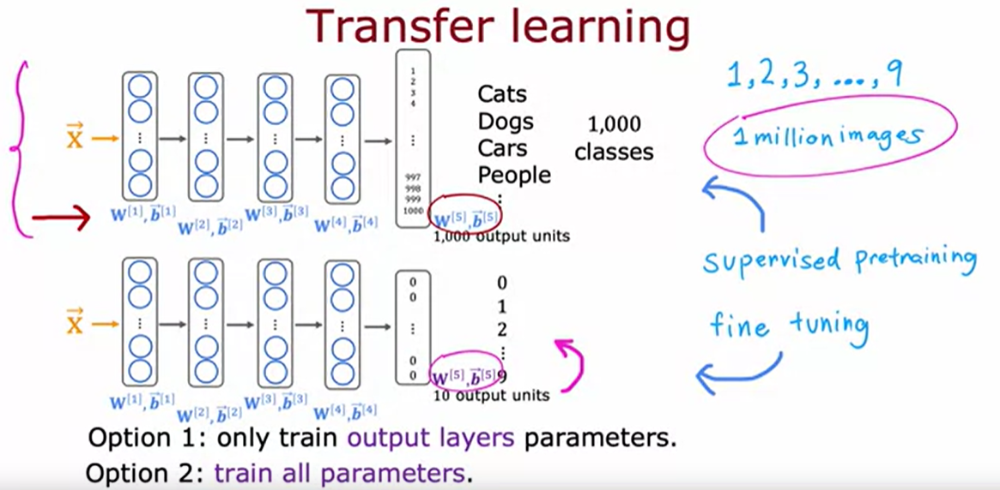

<h3>Day 10</h3>

 I learned about decision trees. 
Course link:
<a href='https://www.coursera.org/learn/advanced-learning-algorithms'>Machine Learning Specialization</a>
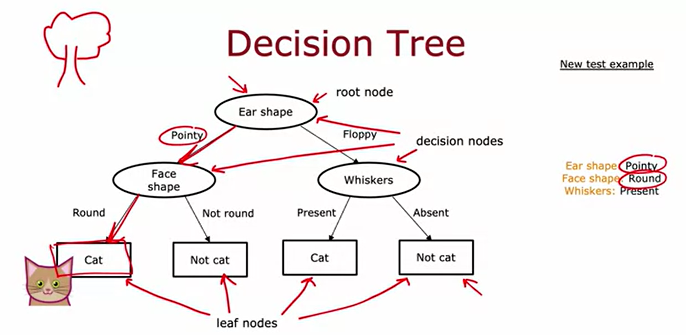

<h3>Day 11</h3>

 I learned about the learning process of the decision tree through recursive splitting and implemented a version of it from scratch to calculate the information gain on each feature. 
Course link:
<a href='https://www.coursera.org/learn/advanced-learning-algorithms'>Machine Learning Specialization</a>
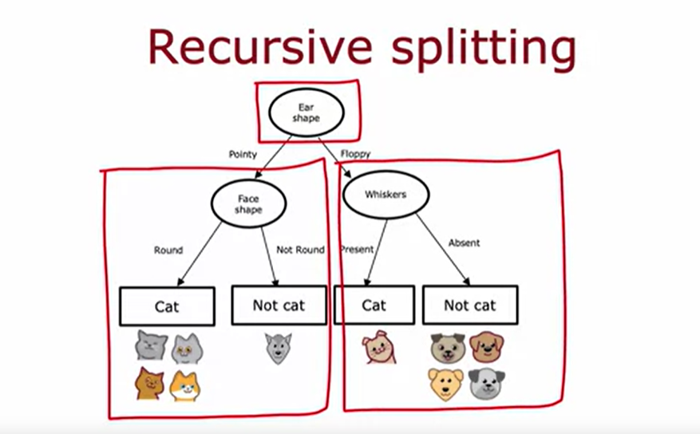
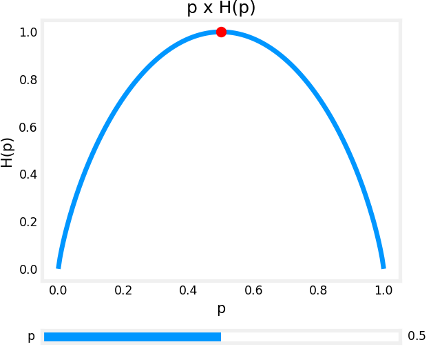
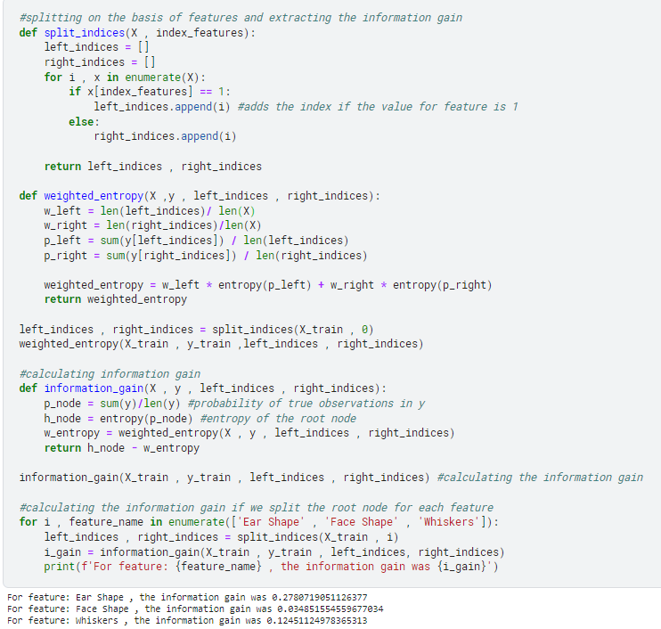

<h3>Day 12</h3>

 I learned to implement decision trees, random forest and XGBoost using libraries. 
Course link:
<a href='https://www.coursera.org/learn/advanced-learning-algorithms'>Machine Learning Specialization</a>
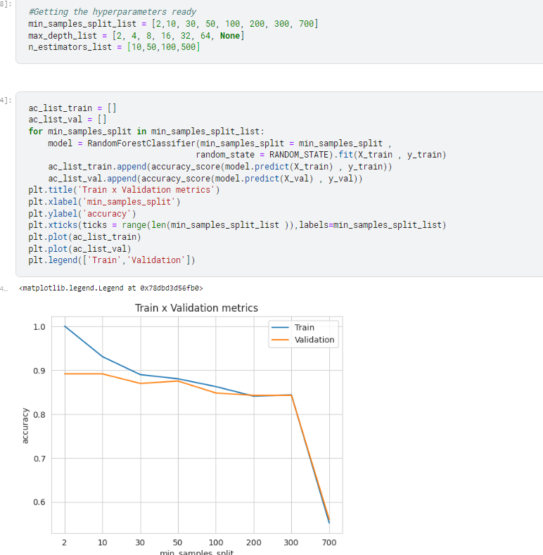
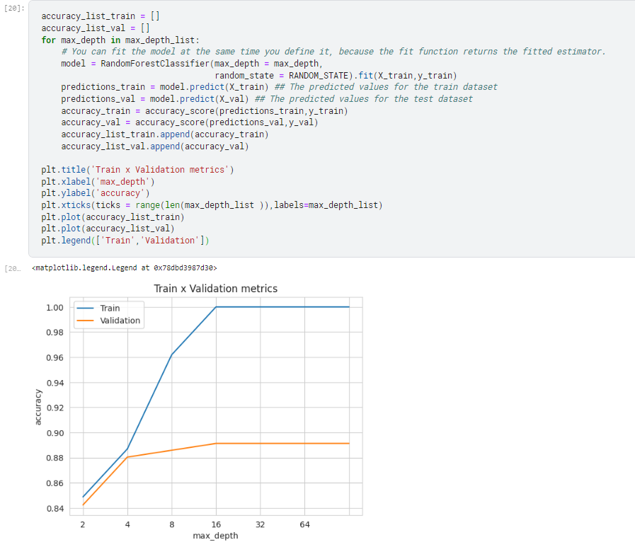

<h3>Day 13</h3>

 I learned to about KMeans algorith and its implementation for unsupervised learning. 
Course link:
<a href='https://www.coursera.org/learn/unsupervised-learning-recommenders-reinforcement-learning/home/week/1'>Machine Learning Specialization</a>
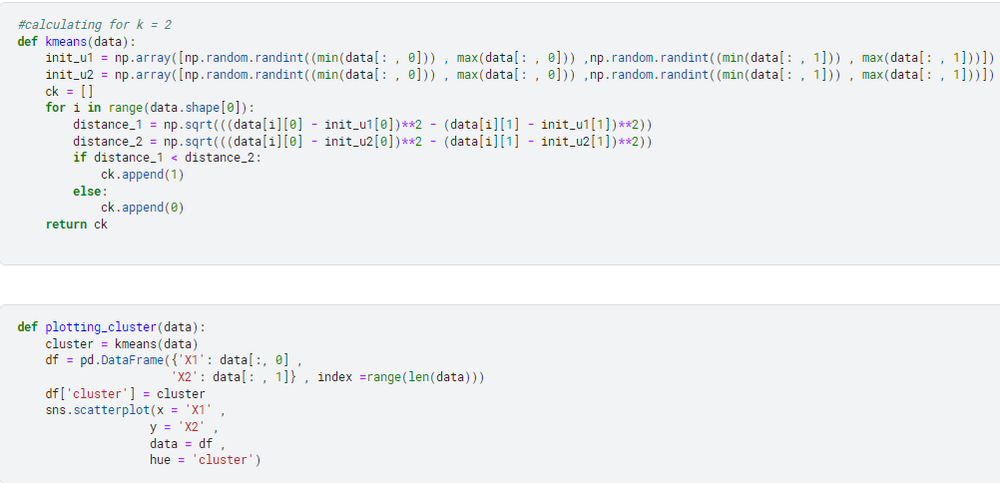

<h3>Day 14</h3>

 I learned to about Anomaly Detection algorith and its implementation for unsupervised learning. 
Course link:
<a href='https://www.coursera.org/learn/unsupervised-learning-recommenders-reinforcement-learning/home/week/1'>Machine Learning Specialization</a>
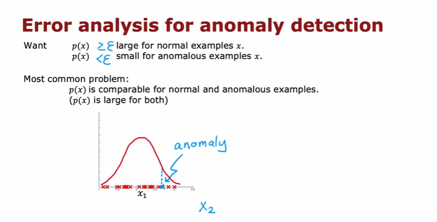

<h3>Day 15</h3>

 I started learning about Reinforcement learning for unsupervised learning. 
Course link:
<a href='https://www.coursera.org/learn/unsupervised-learning-recommenders-reinforcement-learning/home/week/1'>Machine Learning Specialization</a>
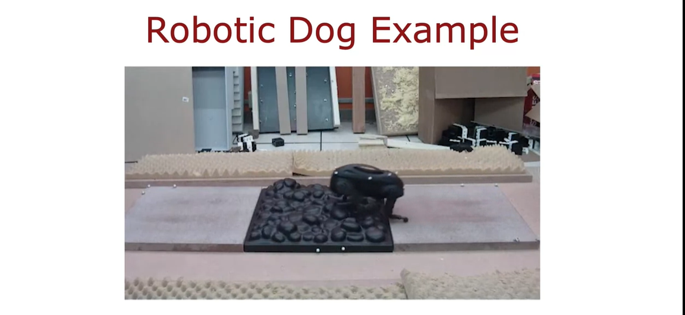

<h3>Day 16</h3>

 I learned about state-action value function Reinforcement learning for unsupervised learning. 
Course link:
<a href='https://www.coursera.org/learn/unsupervised-learning-recommenders-reinforcement-learning/home/week/1'>Machine Learning Specialization</a>
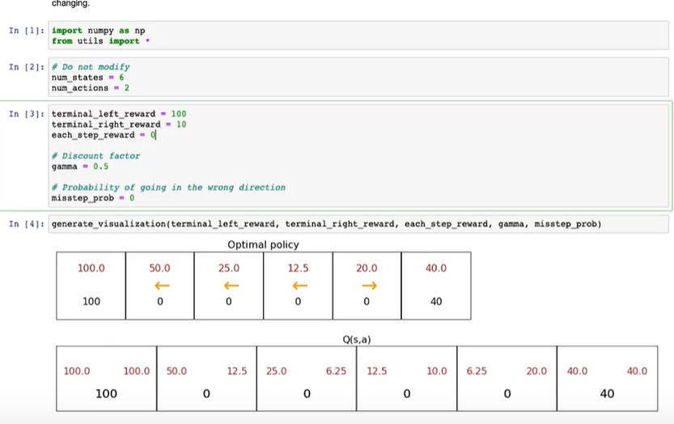

<h3>Day 17</h3>

 I learned about Bellman equation in Reinforcement learning for unsupervised learning. 
Course link:
<a href='https://www.coursera.org/learn/unsupervised-learning-recommenders-reinforcement-learning/home/week/1'>Machine Learning Specialization</a>
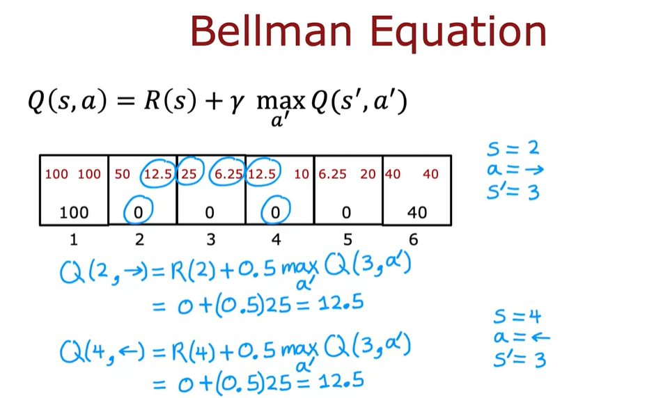

<h3>Day 18</h3>

 I learned about Recommender system. 
Course link:
<a href='https://www.coursera.org/learn/unsupervised-learning-recommenders-reinforcement-learning/home/week/1'>Machine Learning Specialization</a>
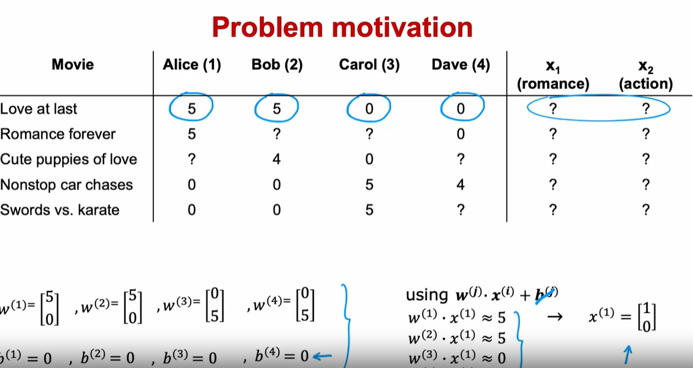

<h3>Day 19</h3>

 I learned about collaborative filtering and mean normalization. Implementation of collaborative filteration in tensorflow. 
Course link:
<a href='https://www.coursera.org/learn/unsupervised-learning-recommenders-reinforcement-learning/home/week/1'>Machine Learning Specialization</a>

<h3>Day 20</h3>

 I learned about content-based filtering and its implementation of  in tensorflow. 
Course link:
<a href='https://www.coursera.org/learn/unsupervised-learning-recommenders-reinforcement-learning/home/week/1'>Machine Learning Specialization</a>
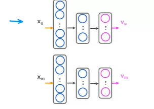
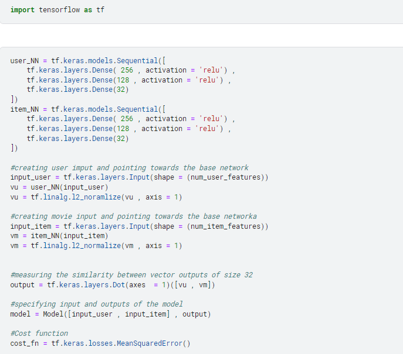

<h3>Day 21</h3>

 I learned about principal component analysis and its implementation using scikit-learn. 
Course link:
<a href='https://www.coursera.org/learn/unsupervised-learning-recommenders-reinforcement-learning/home/week/1'>Machine Learning Specialization</a>
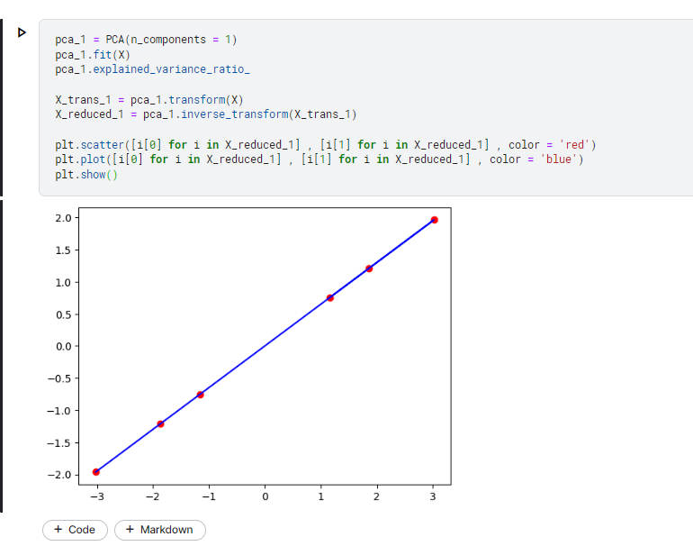

<h3>Day 22</h3>

 Project on titanic survival prediction using Decision Trees with 75% accuracy.  
Course link:
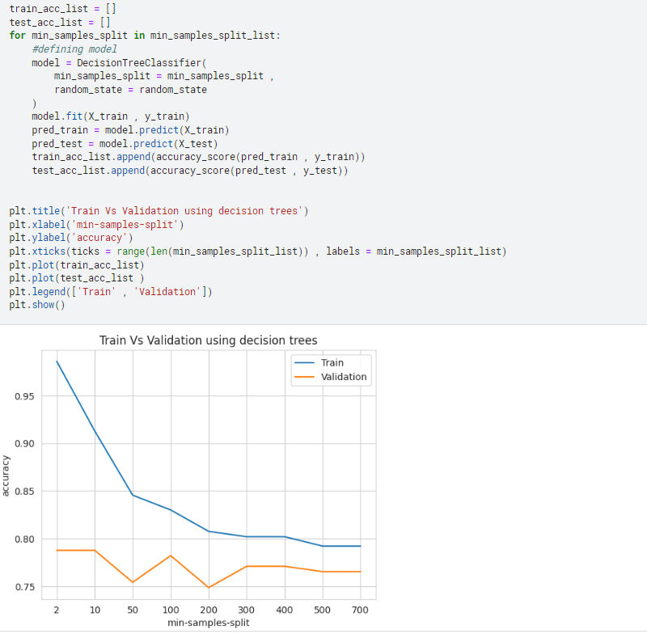

<h3>Day 23</h3>

 Project on titanic survival prediction using RandomForest with 77% accuracy. Will do feature engineering to improve its performance.
Course link:
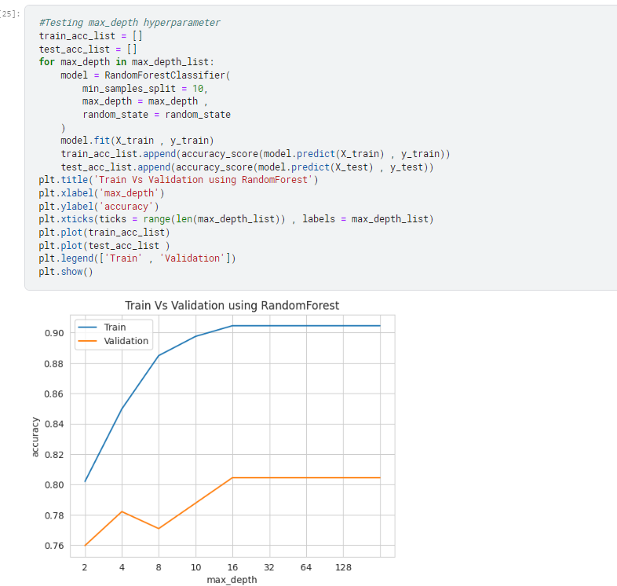

<h3>Day 24</h3>

Learned about Support Vector Classifier and Maximal marginal classifier.
Course link:
<a href="https://statlearning.com">ISLP</a>
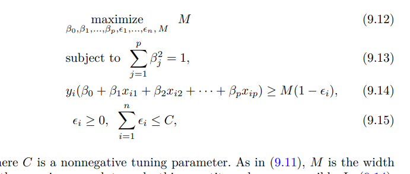

